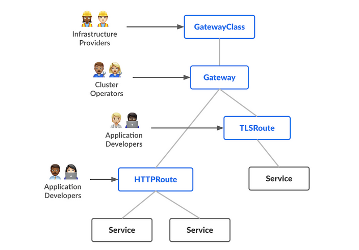

# Verify GatewayClass
kubectl get gatewayclass
kubectl describe gatewayclass <name>

# Verify gateway
kubectl get gateway or kubectl get crds | grep gateway
kubectl describe gateway <name>

# Verify httpRoute 
kubectl get httproute or kubectl get crds | grep httproute
kubectl describe httproute <name>

# Test route 
kubectl get svc
kubectl get endpoints
kubectl get gateways -o yaml | grep address

kubectl get gateway -o wide
curl http://<gateway-ip>/path

# Debug
kubectl describe httproute <route>
kubectl logs -n <namespace> <gateway-controller-pod>
kubectl describe gateway <gateway>

# create a new deployment based on the `nginx` image and expose the container on port 80
kubectl create deployment web --image=nginx --port=80

# create the service by exposing the deployment `web` and set the service to be exposed on port 80 and target port 80 in the pod
kubectl expose deployment web --port=80 --target-port=80